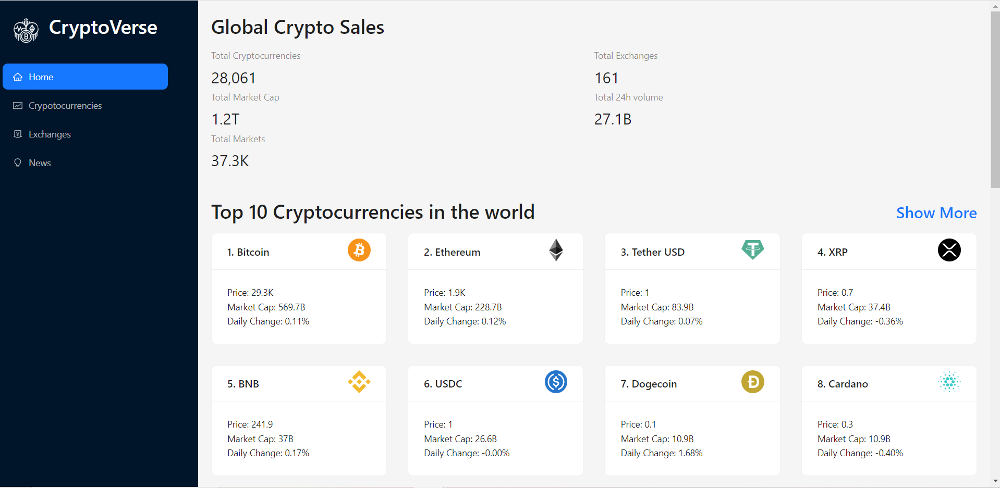

<h1 align="center">CryptoVerse | Crypto News Application</h1>
<h3 align="center">Live at https://cryptoblogapp.netlify.app/</h3>
Welcome to the Crypto Currency News Application – your one-stop destination for all things crypto! Stay ahead of the game with real-time updates, news and many more things about the latest developments in the cryptocurrency world. From major market movements to groundbreaking developments, our user-friendly platform ensures you never miss a beat.

PS: The Exchanges section is still under development.  Also the prices listed are in US Dollars($). 😅
 

<h1>Technologies Used</h1>
<ul>
<li><strong>ReactJs</strong></li>
<li><strong>Redux Toolkit</strong></li>
<li><strong>Chart.js</strong></li>
<li><strong>Javascript</strong></li>
<li><strong>CSS</strong></li>
</ul>

<h1>Features 🎯</h1>
<ul>
<li><strong>Homepage:</strong> Shows Global Crypto Stats, Top 10 Cryptos in the world and Latest Crypto news.</li>
<li><strong>Cryptocurrencies:</strong> Shows diffferent cryptos in the world and also all of its details including charts, links, baisc info, basic stats, generic stats</li>
<li><strong>Exchanges:</strong> Lists various crypto exchnages platforms and their performances. Still under development.😅</li>
<li><strong>News: </strong> The Latest news about all the cryptos around the world</li>
</ul>

 

# 🚀Getting Started (Locally)

This project was bootstrapped with [Create React App](https://github.com/facebook/create-react-app).

## Available Scripts

<h3>Install dependencies</h3>

Before starting the servers, make sure to install the dependencies by running the command:

 ### `npm install`

In the project directory, you can run:

### `npm start`

Runs the app in the development mode.\
Open [http://localhost:3000](http://localhost:3000) to view it in your browser.

The page will reload when you make changes.\
You may also see any lint errors in the console.

### `npm test`

Launches the test runner in the interactive watch mode.\
See the section about [running tests](https://facebook.github.io/create-react-app/docs/running-tests) for more information.

### `npm run build`

Builds the app for production to the `build` folder.\
It correctly bundles React in production mode and optimizes the build for the best performance.

The build is minified and the filenames include the hashes.\
Your app is ready to be deployed!

See the section about [deployment](https://facebook.github.io/create-react-app/docs/deployment) for more information.

### `npm run eject`

**Note: this is a one-way operation. Once you `eject`, you can't go back!**

If you aren't satisfied with the build tool and configuration choices, you can `eject` at any time. This command will remove the single build dependency from your project.

Instead, it will copy all the configuration files and the transitive dependencies (webpack, Babel, ESLint, etc) right into your project so you have full control over them. All of the commands except `eject` will still work, but they will point to the copied scripts so you can tweak them. At this point you're on your own.

You don't have to ever use `eject`. The curated feature set is suitable for small and middle deployments, and you shouldn't feel obligated to use this feature. However we understand that this tool wouldn't be useful if you couldn't customize it when you are ready for it.

## Learn More

You can learn more in the [Create React App documentation](https://facebook.github.io/create-react-app/docs/getting-started).

To learn React, check out the [React documentation](https://reactjs.org/).

### Code Splitting

This section has moved here: [https://facebook.github.io/create-react-app/docs/code-splitting](https://facebook.github.io/create-react-app/docs/code-splitting)

### Analyzing the Bundle Size

This section has moved here: [https://facebook.github.io/create-react-app/docs/analyzing-the-bundle-size](https://facebook.github.io/create-react-app/docs/analyzing-the-bundle-size)

### Making a Progressive Web App

This section has moved here: [https://facebook.github.io/create-react-app/docs/making-a-progressive-web-app](https://facebook.github.io/create-react-app/docs/making-a-progressive-web-app)

### Advanced Configuration

This section has moved here: [https://facebook.github.io/create-react-app/docs/advanced-configuration](https://facebook.github.io/create-react-app/docs/advanced-configuration)

### Deployment

This section has moved here: [https://facebook.github.io/create-react-app/docs/deployment](https://facebook.github.io/create-react-app/docs/deployment)

### `npm run build` fails to minify

This section has moved here: [https://facebook.github.io/create-react-app/docs/troubleshooting#npm-run-build-fails-to-minify](https://facebook.github.io/create-react-app/docs/troubleshooting#npm-run-build-fails-to-minify)
